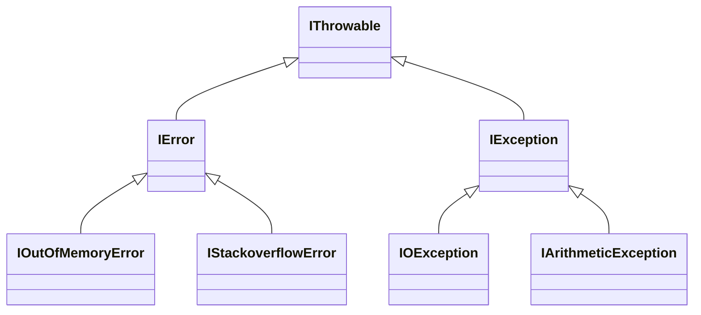
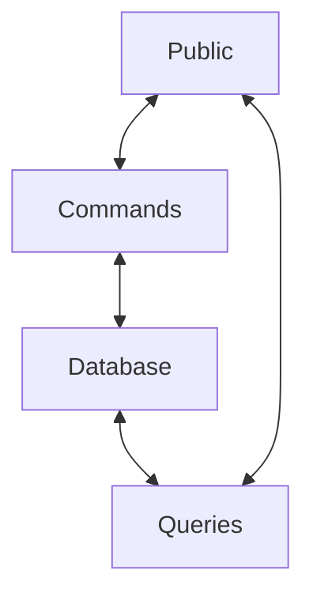
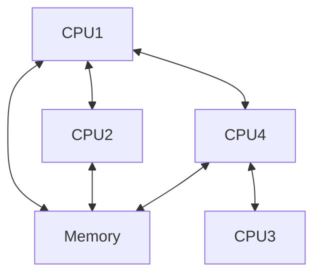
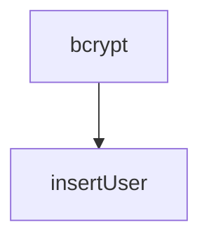

# Session 06: Error Handling and Concurrent Programming

The recommendation in Scala is to use immutable data types by default. Indeed, they have desirable properties such as being thread-safe and allowing local reasoning. However, in some cases, mutable variables lead to simpler code, as you will see in the lectures. We then dive into different testing techniques such as unit testing, property-based testing, integration testing, and mocking.

#### Learning Objectives
- Understand the tradeoffs of using mutable values vs immutable values
- Write unit tests
- Write property-based tests
- Write mocks
- Write integration tests

## Error Handling

### Error Handling

Let's check a low level mechanism to handle unexpected errors. So far, we have overlooked error handling. When you run a program, what con go wrong?

- error in input, user can fix,
- programming errors, programmer can fix,
- hardware failure, external systems not working, and so on.

In all these cases, the program cannot return a result. What we can do then?

- abort the program,
- Report the errors to te user or the programmer,
- Retry, implement some form of resilience.

About reporting, to the user, we want to give informative error message, so they can fix bad input. To the programmer, we want to give detailed information that relates to the source code, to ais with debugging.

In practice, when something unexpeced happens, the execution flow of the program can be interrupted. The low-level language mechanis that is involved is called **exceptions**.

Exceptions can be thrown at any point of the execution of the program. They interrupt the execution flow unless they are **caught** by a surrounding exception handler.

In Scala, you can throw an exception by using a **throw expression**:

```scala
def attemptSomething(): Unit =
    println("So far, so good")
    println("Still there")
    throw Runtime Exception("We cannot continue")
    println("You will never see this")
```

> Note: unlike Java, there is no notiong of "checked" exception in Scala. Any methods can throw any exceptions at any time without having to declare it it its signature.

There is a default exception handler that stops the program after printing **stack trace** to the standard error.
[](https://mermaid-js.github.io/mermaid-live-editor/edit#pako%3AeNp90MEKwjAMBuBXKTkpuhcYIogK7iAIXnuJbdCibSXNhDF9dytTD1PWU_rnIy1pwURLUIK5YEorh0dGr4PKZyNy3RPfiFVR3OeqWqHgARMtjKGUOtQL1exeFGpHnFwSCvLpDuAqbMlHbgZpqSZMaF_haNyJ30cyWsYQyIiLQZlvOeD7Q_uf-UNgCp7Yo7N5a-0r0yAn8qShzKVFPmvQ4ZFdfbUotLZOIkMpXNMUsJa4b4L53DvzXnwXPp7k6Ymb)
```
Exception in thread "main" java.lang.RuntimeException: We cannot continue
    at exceptions$package$.attemptSomething(exceptions.scala:6)
    at exceptions$package$.run(exceptions.scala:10)
    at run.main(exceptions.scala:9)
```

Stack traces show the call chain, starting from the position where the error was thrown. Note that the JVM prefixes the methods name with tis class name. This can lead to synthetic names such as `exceptions$package$` for top-level definitions or object definitions.

Exceptions can be caught with a `try/catch` handler:

```scala
@main def run(): Unit =
    try
        attemptSomething
    catch
        case exn: RuntimeException =>
            System.err.println(s"Something went wrong: $exn")
            println("Stopping the program")
```

The syntax for catching exceptions is similar to pattern matching:

```scala
try
    attemptSomething()
catch
    case exn: ArithmeticException =>
        println("An aritmetic exception ocurred.")
    case exn: RuntimeException =>
        println("Something unexpeccted happened")
```

Exception classes are defined in the standard library and form a type hierarchy. Each patter of the `catch` clause check whether the exception that happened is of some specific type or not. `catch` clauses do not have to be exhaustive.

Below we share the `Throwable` hierarchy:



There are some types of "throwables" that your programs should never try to catch, such as `OutOfMemoryError`. These are known as fatal exceptions.

A `try/catch` block is an expression that return a value:

```scala
val stream = getClass.getResourceAsStream("data.txt")
val data =
    try
        parseIntData(stream)
    catch
        case NonFatal(exn) => -1
    finally
        stream.close()
```

Those expressions can be followed by a `finally` clause that is executed both if no exceptions were thrown or if an exception was thrown.

In summary, exceptions are a low-level mechanism for dealing with unexpected problems during the program execution. Throwing an exception interrupt the program execution unless the exception is cooked by a handler.

### Error Handling with Try

Let's review a high level variant of `try/catch` handler, which also provides the benefits of checked exceptions because it explicitly signals the possibility of a failure in type signatures.

We have seen that runing a program may be interrupted in case something unexpected happens an the program throws an exceptions. What should we do about that? In some cases, aborting the program execution is what we want, so there is no need to handle exceptions. However in most cases, we do not want to abort the program execution: Servers need to return a response, long-running programs need to keep running, etc.

In case we need to handle exceptions, shoudl we add `try/catch` handlers around each expression? This *defensive* way of programming would be very inconvenient. One way to address this problem is to explicity model the fact that our program can fail. In the next sections we will introudce different techniques to achieve this. For now, lets check some guides to explicit modeling of failures.

- If exception sare used as a last resort only, there is no need to be defensive, unless we call an API that we know uses exceptions (e.g., some low-level APIS)
- Just define an exception handler at the beginning og your program, or use the default exceptions handler provided by the runtime.
- Explicitly indicate in the result type of a method that it can either succeed or fail.

You can explicitly indicate that a method may fail by returning a value of type `Try`:

```scala
import scala.util.Try

def attemptSomething(): Try[Unit] =
    Try {
        println("So far, so good")
        println("Still there")
        throw Runtime Exception("We cannot continue")
        println("You will never see this")
    }
```

The type `Try[A]` inform users that the program may fail. A value of type `Try[A]` can either be a `Success[A]`, or a `Failure`.  If an exception is thrown withing a `Try {...}` block, we get a `Failure`, othrewise we get a `Success` containing the result of evaluating the block.

At the use site, onew way to handle errors is by calling the `recover` error method:

```scala
@main def run(): Unit =
    attemptSomething
        .recover {
            case exn: RuntimeException =>
                System.err.println(s"Something went wrong: $exn")
                println("Stopping the program")
        }
```

So, we use recover like we would use `catch` in a `try` expression.

Partial functions are functions that may not be defined on all their domain type. For instance, a `PartialFunction[Int, String]` is a function that may not be defined fo some `Int` values. Before applying a partial function to a value, you should check that it is defined for this value by calling `isDefinedAt`:

```scala
if somePartialFunction.isDeinedAt(someValue) then
    somePartialFunction(someValue)
```

In the previous example, the return type of `attemptSomething`, was `Try[Unit]`, which means that this program may fail but does not retunr a meaning.

Alternatively, consider a program

```scala
import java.time.LocalDate

def parsseDate(str: String): Tru[LocalDate]
```

which may fail to return a `LocalDate`. You van use it as follows:

```scala
import scala.util.{Failure, Success}

parseDate("2022-02-02") match
    case Success(date) => println("Successfully parsed date")
    case Failure(throwable) => println("Failed to parse date")
```

Returning a value of type `Try[A]`, as opposed to returning a value of type `A` is a double edged sword:

- On the one hand, callers of your program won´t be surprised by a possible failure,
- On the other hand, they will have to deal with failures; the cannot just ignore them an let the program be aborted.


Explicit modeling of failures may not always be relevant. It is robably a good choice, though, if the failure is likely to happen (e.g., parsing data, openning file, performing remotes calls).

A typical use case is to wrap a Java API that models failures by throwing exceptions.

In summary, the type try makes it explicit that the computation may fail, and it lets you manipulate, successful, result or recover from exceptions. The value of type try can be either a success or failure. It is common practice to use try blocks to wrap calls to API that model failure by throwing exceptions.

### Manipulating Try Values
Let's review the most common high-level operations to use to manipulate values of type `Try`.

For instance, consider a situation where you want to read two dates from `String` values, and compute the duration between theme. Parsing a date is an operation that may fail, but for this case we do not to deal with the failures yet, lets to focus on the case where both dates were successfully parsed. Please check the contents in `examples/week_6/src/main/scala/org/epfl/03_try/parsingDates.worksheet.sc`

```scala
import java.time.LocalDate
import java.time.Period
import scala.io.Source
import scala.util.{Success, Try, Using}

def parseDate(str: String): Try[LocalDate] =
  Try(LocalDate.parse(str))

def tryPeriod(str1: String, str2: String): Try[Period] =
  parseDate(str1).flatMap { date1 =>
    parseDate(str2).map { date2 =>
      Period.between(date1, date2)
    }
  }

tryPeriod("2020-07-27", "2020-12-25") // : Try[Period] Success
tryPeriod("2020-19-27", "2020-12-25") // : Try[Period] Failure
```

Alternatively, we can use the `for comprehesion` in the body of the function `tryPeriod` that is a syntactic sugar for nested flatMaps.

```scala
def tryPeriod(str1: String, str2: String): Try[Period] =
    for
        date1 <- parseDate(str1)
        date2 <- parseDate(str2)
    yield
        Period.between(date1, date2)
```

The result is the same.

Here is a summary of the transformation operations on the type Try.

```scala
trait Try[A];
    def map[B](f: A => B): Try[B]
    def flatMap[B](f: A => Try[B]): Try[B]
    def recover(f: PartialFunction[Throwable, A]): Try[A]
    def recoverWith(f: PartialFunction[Throwable, Try[A]]): Try[A]
end Try
```

Now lets go deep with a harder problem: Instead of parsing just two dates, we lets parse an arbitrary number of dates, read from a file. Each date is written in a new line:

```
1970-01-01
2004-01-20
2016-07-15
```

A first approach could be:

```scala

def readDateStrings(fileName: String): Try[Seq[String]] = Try {
    val source = Source.fromFile(fileName)
    val dateStrings = source.getLines.toSeq

    source.close()
    dateStrings
}
  
def parseDates(fileName: String): Try[Seq[LocalDate]] =
  readDateStrings(fileName).flatMap { dateStrings =>
    dateStrings.foldLeft[Try[Seq[LocalDate]]](Success(Vector.empty[LocalDate])) {
      case (tryDates, dateString) =>
          for
              dates <- tryDates
              date <- parseDate(dateString)
        yield
            dates :+ date
    }
  }

parseDates("./src/main/scala/org/epfl/03_try/dates-file.txt")
```
Here we can rewrite the `readDateStrings` function with `Using` to mx in resource acquisition and release with operations that can fail:

```scala
def readDateStrings(fileName: String): Try[Seq[String]] =
  Using(Source.fromFile(fileName)) { source =>
    source.getLines().toSeq
  }

```

In summary, you should leverage the operations `map` and `flatMap` to manipulate Try values while postponing failure handling to a later point in the program. And you should also leverage `Using` to mix in resource acquisition and release with operations that can fail.

### Validating Data

Lets check another way to model failures, which is mor appropirate for reporting validation errors to the end users.

We have seen how to use exceptions to handle errors. These solutions have the property of stopping the execution flow of the program as soon as ther is an error.

As a consequence, they might not be appropriate for reporting validation error to the end-users of an applicaiton. Indeed, in this case we might want to provide a **list of errors** (e.g., a list of properties that are invalid in a JSON object). 

In practice, projects might use a third-party library to handle validation errors. For learning purposes we introduce a general framework to reason about validation error, without relying on a specific library.

First, we model validation errors as a collection of `String` message:

```scala
type Errors = Seq[String]
```

Then, we model the type of "a validated value of type A" to be either `Errors` or `A`.

```scala
type Validate[A] = Either[Errors, A]
```

The type `Either` comes from the Scala standar library and models a value that can be either of one type or of another type. `Either` takes two type parameters, the _left_ type, and the _right_ type.

In our example, a valid value of type `Validated[Int]` can be constructed like this:

```scala
val validInt: Validated[Int] = Right(42)
```

Conversely, an invalid value of type `Validated[Int]` would be constructed as follows:

```scala
val invalidInt: Validated[Int] = Left(Seq("Invalid integer"))
```

We can use pattern matching to inspect the content of a validated value:

```scala
validInt match
    case Right(n) => prinln(s"Got a valid integer: $n")
    case Left(errors) => prinln(s"Got validation errors: $errors")
```

Like with `Try`, we can use the operation `map` to tranform a valid (_right)_ value without having to deal with the error cases:

```scala
validInt.map(n => n + n) // : Validated[Int] = Right(84)
invalidInt.map(n => n + n) // : Validated[Int] = Left(Seq("Invalid integer"))
```

The operation `map` only transforms the "right" value of the `Either`. For this reason, our `Validated[A]` type sets the error on the "left" side, and the success on the "right" side.

Again, similar to `Try`, we can use the operation `flatMap` to transform a valid value with a function that also returns a validated value.

For instance, to parse two dates an compute the period between them:

```scala
def parseDate(string: String): Validated[LocalDate] = ...

def validatePeriod(str1: String, str2: String): Try[Period] =
    for
        date1 <- parseDate(str1)
        date2 <- parseDate(str2)
    yield
        Period.between(date1, date2)
```

This implementation is very similar to the one that uses `Try` in the previous section.

However there is a problem with this implementation and it is that only one error is returned. The goal is report all possible error to the user.

We need an operation for combining validated values such that:

- two valid values prodcue a valid value containing a pair,
- one or two invalid values produce an invalid value containing all the validation errors.

The signature an the respective implementation of this operation could be the following:

```scala
def validateBoth[A, B](
    validateA: Validated[A],
    validateB: Validated[B]
): Validated[(A, B)] =
    (validatedA, validatedB) match
        case (Right(a), Right(b)) => Right((a, b))
        case (Left(e), Right(_)) => Left(e)
        case (Right(_), Left(e)) => Left(e)
        case (Left(e1), Left(e2)) => Left(e1 ++ e2)
```

With this operation we can use it like this:

```scala
def validatePeriod(str1: String, str2: String): Validated[Period] =
    validateBoth(parseDate(str1), parseDate(str2))
        .map((date1, date2) => Period.between(date1, date2))

validateDuration("nota a date", "not a date either")
// : Validate[Period] = Left(
//   List(
//      "Text 'not a date' could not be parsed"
//      "Text 'not a date either' could not be parsed"
//   )   
// )
```

Both errors are reported!

In summary, we have discovered a new operation for combining validation results, which accumulates validation errors. We have called it `validateBoth`, but it may exist under the name` product` or `zip` in third-party libraries. In addition to `validateBoth`, transforming values with `map`, and chaining operations that validate values with `flatMap` are still useful operations.


### Manipulating Validated Values

We have seen several building blocks for manipulating validated values.

- _transform_ valid values with `map`
- _chain_ validation rules with `flatMap`
- _aggregate_ valid values (accumulating validation error)  with `validateBoth`

Let's discover another building block for aggregating an arbitrary number of valid values.

Let us revisit the problem of parsing arbitrary number of dates in a file.

For now, let us assume that we have already read each line of the file, so we have a `List[String]`.

We want to parse each of these `String` elements as a date, and return a valid list of dates in cases of success, or a list of errors in case there is a t least one failure.

```scala
def parseDates(strs: Seq[String]): Validated[Seq[LocalDate]]
```

We already know how to parse a single `String` as a date:

```scala
def parseDate(str: String): Validated[LocalDate] =
  Try(LocalDate.parse(str)).toEither
    .left.map(error => Seq(error.getMessage))
```

The method `parseDates` validates that each `String` element of a list is a `date`. It returns either a valid list of `LocalDate`, or a list of validation errors.

In practice, validating each element of a collection is a common thing to do. Could we generalize what `parseDates` does to an arbitrary type of elements `A`,  to which we want to apply an arbitrary validation rule `A => Validated[B]`?

```scala
def validateEach[A, B](as: Seq[A])(f: A => Validated[B]): Validated[Seq[B]]
```

Then, the implementation of `parseDates` will something like:

```scala
def parseDates(strs: Seq[String]): Validated[Seq[LocalDate]]
    validateEach(strs)(parseDate)
```

> Note: please check these implementations in the file `scala-learning/examples/week_6/src/main/scala/org/epfl/05_validateEach/parsingDates.worksheet.sc`

Luckily, third-party libraries already implement validateEach for you. This mtehod is often called `traverse`, or `foreach`

In summary, we have the next operation list over `Either`:

- _transform_ valid data with `map`
- _aggregate_ valid data (accumulating validation error)  with `validateBoth`
- _chain_ validation rules with `flatMap`
- _validate_ a collection of values with `validateEach`

These operations are the building blocks for implementing complex validation scenarios. In practice, these operations might be provided with different names by third-party libraries.

### Combining Try and Either

In previous lessons, we have seen how to manage exceptions with `Try`, and how to manage data validation with `Either`. In a complete program that manage both; exceptions and validations, how do we combine them?

Let us have a look at our example where we want to parse an arbitrary number of dates from a file. Each date is written in a new line. We want to return an error message for each date that was not properly formatted. In case another error happens (e.g., unable to read the file) the program should log the error in the standard error stream an stop.

We break down our program in two main components:

1. `readAndParseDates`, tries to read the file and parse its content.
2. `run` calls the first component and shows the error message in case of failure.

```scala
def readAndParseDates(fileName: String): Try[Validated[Seq[LocalDate]]]

def run(fileName: String): Unit
```

The return type of `readAndParseDates` explicitly models the two types of errors we want to handle. `Try` models error that can abort our program execution, whereas `Validated` models the fact that dates read in the file can possibly invalid.

The first step for implementing `readAndParseDates` is to read the file content, which we do in a separate methods, `readDateStrings`. Reading a file with `Source.fromFile` can throw an exception. We explicitly signal to our callers that these errors can happen by having ther return type `Try`:

```scala
def readDateStrings(fileName: String): Try[Seq[String]] =
    Using(Source.fromFile(fileName)) { source =>
        source.getLines().toSeq
    }
```

The next step is implementing a `parseDate` function by wrapping the call to `LocalDate.parse` in a `Try` and then by converting failures into `Left` values, and successes into `Right` value":

```scala
def parseDate(str: String): Validated[LocalDate] =
    Try(LocalDate.parse(str)) match
        case Failure(exception) => Left(Seq(exception.toString()))
        case Success(date) => Right(date)
```

We implementing `readAndParseDates` by resusing `readDateStrings` and `parseDate`.

```scala
def readAndParseDates(fileName: String): Try[Validated[Seq[LocalDate]]] =
    readDateStrings(fileName).map { dateStrings =>
        validateEach(dateString)(parseDate)
    }
```

Finally we implementing the `run` entry point function:

```scala
def run(fileName: String) : Unit =
    readAndParseDates(fileName) match
        case Failure(exception) =>
            System.err.println(s"Unable to parse dates file: $exception")
        case Success(validatedDates) =>
            validatedDates match
                case Left(errors) =>
                    println(s"Invalid data: ${errors.mkString(", ")}")
                case Right(dates) =>
                    println(s"Successfully parsed dates: ${errors.mkString(", ")}")
```

In summary, the more types of error we model, the more complex our types become. In this case, we have used the `Try[Validated[A]]` to model the fact that there are two type of errors:

1. validation errors that we want to report to the user for them to fix; and
2. other errors that the user cannot deal with.

## Asynchronous Programming
### Concurrent Programming

Nowdays, distributed systems power a lot of applications (e.g., web and mobile applications). These systems are made of several physical machines (a.k.a. nodes) communicating together.
 
The client devices execute some parts of the program, and the server executers other parts of the program. We say that the execution of the programs is disributed between several machines. These architecture have several challenges. For example:

- What happens if multiple clients modify the state of the system at the same time>
- Can the server handle request coming from other clients whilte it is already busy responding to one client?

If we zoom the server node, the same pattern might be used internally:



Similar concerns arise: can the system handle the application of two commands at the same time? Is it possible to read the system state while commands are still being processed? Indeed, distributed computations are ubiquitous.

Last, if we zoom again on one node it can use the same pattern again to leverage the multiple CPUs of the machine:



Again: what happens if multiple computations modify the memory at the same time? How can a computation running in a CPU depend on the result of another computation running in a different CPU?

Leveraging multiple CPUs in a single program requires **multi-threading**. Sharing data between threads requires using **thread-safe** data structures (similarly, sharing data between nodes requires some form of transactions in the underlying database system).

Within a single JVM, use thread-safe data structures such as the ones in the package `java.util.concurrent.atomic` or `scala.collection.concurrent`.

Between processes or nodes, you can rely on third-party database systems.

Whether you perform a remote call, or you start a computation in an different thread, you eventually need a way to "do something" with the result.

In Scala, in both situations we use the type `Future` to model the result of such computations. A `Future` represents a value that may not be available yet, but might become available in the future -- when whatever is computing it has finished.

As a first example, consider the following signature of a program that inserts a new user in a remote database and eventually returns a result of type `User`:

```scala
def insertUser(login: String, passwordHash: Seq[Byte]): Future[User]
```

As a second example, consider the following signature of a program that computes te cryptographic hash of a password using the BCrypt algorithm. The program start the computation on a different thread and eventually returns a result of type `Seq[Byte]`

```scala
def bcrypt(saltRound: Int, password: String): Future[Seq[Byte]]
```

We will see later how to implement an operation that executes code on a different execution thread. Let us first get a general idea of what it is like to work with operations returning `Future`.

The operations `insertUser` and `bcrypt` return a result to the caller thread possibly _before_ the actual result has been computed. We say that `insertUser` and `bcrypt` are **asynchronous computations**.

The returned `Future` value provides methods to eventually use the actual result _when_ it is available.

The most common way to work with `Future` values is to **transform** them into other `Future` values by using operations very similar to the ones we already use with collections or `Try: map`, `flatMap` and `zip`.

For instance, consider the complete scenario of adding a new user to the system. We first want to compute the user password hash with the operation `bcript`, and, after we get the password hash, insert the user ron in the database with the `insertUser` operation:



By combining `Future` values, we end up building trees of computations with sequential and parallel branches.

The result is necessarily a `Future` value again, which is finally consumed by your application framework or testing framework.

When we run an asynchronous computation, there are two possible outcomes:

- the computation eventually returns a result,
- or, it fails (e.g., an exception is thrown, or the remote service is unreachable)

Later we will see how to handle such failures.

We can model the state of a `Future[A]` value at any point in time with the type `Option[Try[A]]`:

- `None` means that the outcome of the computation is not known yet,
- `Some(Success(a))` means that the computation succeeded,
- `Some(Failure(e))` means that the computation failed.

In summary, Most systems run on several execution threads. Sharing data betweeen several threads of execution requires using thread-safe data structures.

For a program running in a given thread, we model the result of computations possible performed in a different thread with the type `Future`

We usually combine values of type `Future` to build a graph of computations containing sequential and parallel branches

### Operations on Type Future

Let's check how to build sequential and parallel path of computations, by using the most common operations and future values.

In the previous section, we have seen that in Scala, we model asynchronous computations as methods returning `Future`. The execution of these computations eventually fails or succeeds. Orchestating asynchronous computations is like building a directed graph of computations.

Similar to what we say with `Try` and `Validated`, we can use `map` and `flatMap` to transform the result of a succesful asynchronouse computation.

For instance, assuming we use an in-memory database, we have the following operations:

```scala
def bcrypt(saltRound: Int, password: String): Future[Seq[Byte]]
def insertUser(login: String, passwordHast: Seq[Byte]): User
```

Computing a password has and then inserting a user is achieved like this:

```scala
def hashPasswordAndInsert(name: String, password: String): Future[User] =
    bcrypt(10, password)
        .map(passwordHash => insertUser(name, passwordHash))
```

Let's review in deep how is the behavior in asyncrhonous programming. For example, check the next snippet:

```scala
println("calling bcrypt")
bcrypt(10, "asimplepassword").map(hash => printlin(s"bcrypt result: $hash"))
println("bcrypt called")
```

We can say that:

- the message "calling bcrypt" will be printed before the `bcrypt`method is called,
- the message "bcrypt result: ..." will be printed after the `bcrypt` method call has terminated

But we have **no guarantee** that the message "bcrypt called" will be printed _before_ or _after_ the message "bcrypt result: ...".

In practice, you are likely to use a remote database. In such a case, the operation `insertUser` would also be asyncrhonous. So, you want to chain two asyncrhonouse computations:


We achieve this with the operations `flatMap`:

```scala
def hashPasswordAndInsert(name: String, password: String): Future[User] =
    bcrypt(10, password)
        .flatMap(passwordHash => insertUser(name, passwordHash))
```

Now let's start to orchestate the insertion of two users `Pam` and `Jim` asynchronously. We construct a `Future` value that complete when two `Future` values complete with the operation `zip`:

```scala
val eventualPam: Future[User] =
    hashPasswordAndInsert("Pam", "averycomplicatedpassword")

val eventualJim: Future[User] =
    hashPasswordAndInsert("Jim", "anothercomplicatedpassword")

val eventualPamAndJim: Future[(User, User)] =
    eventualPam.zip(eventualJim)
```

To join not just two asynchronous competitions, but an arbitrary number of asynchronous competitions. You can use the operation `traverse`. `taverse` runs as many asynchronous computations as there are elements in the collection and returns a `Future` value eventually containing all the results in a collection. 

```scala
val userData Seq[(String, String)] = Seq(
    "Pam" -> "averycomplicatedpassword",
    "Jim" -> "anothercomplicatedpassword",
)

val eventualUsers: Future[Seq[User]] =
    Future.traverse(userData)(hashPasswordAndInsert)
```

The asynchronouse computations are executed independently of each other, in no predifined order.


So far, we have seen how to transform and chain successful asynchronous computations. What happens if an asynchronouse computations fails?

We represent failures with "failed" `Future` values containing an exception. Like with `Try`, we can handle these failures with the operation `recover`:

```scala
val eventuallyInserted: Future[Boolean] =
    hashPasswordAndInsert("Pam", "averycomplicatedpassword")
        .map(_ => true)
        .recover { case NonFatal(exception) => false }
```

Similar to `recover`, another operations for handling failed `Future` values is `recoverWith`. The difference is that `recoverWith` _tries_ to recover from the failure by running another asynchronous computation.

So, below we have a API summary of the most common operations for `Future`:

```scala
trait Future[A]
    def map[B](f: A => B): Future[B]
    def flatMap[B](f: A => Future[B]): Future[B]
    def zip[B](that: Future[B]): Future[(A, B)]
    def recover(f: Throwable => A): Future[A]
    def recoverWith(f: Throwable => Future[A]): Future[A]

object Future
    def traverse[A, B](as: Seq[A])(f: A => Future[B]): Future[Seq[B]]
```

We have seen that the operations `map`, `zip`, `flatMap`, and `traverse` are defined on various types (`Seq`, `Try`, `Either`, `Future`). You might encounter them on other types as well.

These operations are indeed very common, they have been well studied, and you may her about their most general form, named after category theory:

- `map` is defined by the type class `Functor`
- `zip` is defined by the type class `Applicative`
- `flatMap` is defined by the type class `Monad`
- `traverse` is defined by the type class `Traverse`

We expect that now we have a good intuition of what this operations do.

In summary, `map` and `flatMap` let you define what to do _after_ a `Future` value is resolved. They build **sequential** paths of computation.

`zip` and `traverse` let you "join" together an arbitrary number of `Future` values. They builds **parallel** paths of computation.

`recover` and `recoverWith` let you handle failures

### Examples with Future
Let's go deep with `Future` with practical excersices

The purpose of the first exercise is to fetch data from a web service. The web servicer returns data in pages, and provides the following method to fetch one specific page:

```scala
def getPage(page: Int): Future[String]
```

The service also provides the following method to know how many pages there are, in total:

```scala
def getPagesCount(): Future[Int]
```

Exercise:: write a program that fetches all the pages.

```scala
def getAllPages(): Future[Seq[String]] = ???
```

> Note: The complete solution is in the next file: `examples/week_6/src/main/scala/org/epfl/errorhandling/part9/getAllPages_parallel.scala`.

```scala
def getAllPages(): Future[Seq[String]] =
    getPagesCount().flatMap { pagesCount =>
        val allPages = 1 to pagesCount

        Future.traverse(allPages)(getPage)
    }

```

Here we first get the pages count, and then fetch each page with `getPage`. This approach execute the count with parallel tasks. The parallelism level of the program will be discused in the next section.

We can follow a sequential approach to fetches all the pages.

> Note: The complete solution is in the next file:  `examples/week_6/src/main/scala/org/epfl/errorhandling/part9/getAllPages_sequential.scala`.

```scala
def getAllPages(): Future[Seq[String]] =
    getPagesCount().flatMap { pagesCount =>
        val allPages = 1 to pagesCount

        allPages.foldLeft[Future[Seq[String]]](Future.successful(Vector.empty)) {
            (eventualPreviousPages, pageNumber) =>
                eventualPreviousPages.flatMap { previousPages =>
                    getPage(pageNumber)
                        .map(pageContent => previousPAges :+ pageContent)
                }
        }
    }
```

Here we nest the `flatMap` and  `map` opeators.

Finally let's consider that the web service is flaky. In the previous example, if fethcing a page fails, the `getAllPages` method returns a failed `Future`.

Instead, we want to retry at most 3 times before giving up.

```scala
def reisilientGetAllPages(): Future[Seq[Srting]] = ???
```

The logic to fetch the pages will be the same, but instead of call the `getPage` method we call a new `reisilientGetPage` with the number of attemps and an iternal method `attempt`.

> Note: The complete solution is in the next file:  `examples/week_6/src/main/scala/org/epfl/errorhandling/part9/resilientGetAllPages.scala`.

```scala
def reisilientGetPage(page: Int): Future[Seq[String]] =
    val maxAttemps = 3

    def attempt(remainingAttempts: Int): Future[String] =
        if remainingAttemps = 0 then
            Future.failed(Exception(s"Failde after $maxAttempts"))
        else
            println(s"Trying to fetch page $page ($remainingAttemps remmaining attemps)")
            getPage(page).recoverWith { case NonFatal(_) =>
                System.err.println(s"Fetching page $page failed...")
                attempt(remainingAttempts - 1)
            }

    attempt(maxAttempts)

def reisilientGetAllPages(): Future[Seq[String]] =
    getPagesCount().flatMap { pagesCount =>
        val allPages = 1 to pagesCount

        allPages.foldLeft[Future[Seq[String]]](Future.successful(Vector.empty)) {
            (eventualPreviousPages, pageNumber) =>
                eventualPreviousPages.flatMap { previousPages =>
                    reisilientGetPage(pageNumber)
                        .map(pageContent => previousPAges :+ pageContent)
                }
        }
    }
```

### Execution Context

Let's see how asynchronous computations are scheduled by the runtime and that they are executed on so-called execution context. I will also give you some tips to get the most out of the default execution context

So far, we have seen how to control _when_ to execute asynchronous computations (e.g., we can chain them with `flatMap`).

However, whe we call the method `bcrypt`, in which thread is it executed? Also, when we use `map` to transform the result of fetching a resource from a remote service, _where_ is the code executed?

Scala provides a threadpool to execute asynchronous computations. By default, it contains as many threads as the number of physical processors.

This means that operations that combine `Future` values in parallel (`zip` and `traverse`) have a parallelism level equat to the number of processors.

Third parties can provide custom execution context (e.g., with hyst one thread, or with as many threads as possible).

In the standard library, all the operations that return `Future` values also take an implicit parameter of type `ExecutionContext`.

```scala
trait Future[A]:
    def map[B](f: A => B)(using ExecutionContext): Future[B]
    def zip[B](that: Future[B])(using ExecutionContext): Future[(A, B)]
```

The implementation of `map` schedules the execution of calling the function `f` in the given execution context. 


The simplest way to provide such a given `ExecutionContext` is to add the following import:

```scala
import scala.concurrent.ExecutionContext.Implicits.given
```

The default `ExecutionContext` is designed to make all the computing power available to your program.

It tries to fairly distribute the tasks that need to be computed to the threads. However, sometimes a task occupies a thread while doing nothing, for example:

```scala
Future {
    Thread.sleep(10_000)
}
```

This program creates a task that will use a thread to do nothing but waiting 10 seconds. We say that such programs _block_ threads,  because that thread is not available for computing other task in the meantime,.

In practice, blocking happens whe you read a file, or communicates with a remote database witt JDBC. In such a case, you should create more thread than the number of physical processsors, to not starve your thread-pool.

You achieve this by wrapping your "blocking" code in `concurretn.blocking`

```scala
Future {
    concurrent.blocking {
        Thread.sleep(10_000)
    }
}
```

In the previous code examples, we have seen several ways to construct `Future` values.

1. Immediately create a succesful `Future` value by using the constructor `Future.succesful` with a value that you already have on hand.
2. Immediately create a failed `Future` value by using the constructor `Futuer.failed` with an exception.
3. Use a `Future {}` blockt to schedule a computation in the available `ExecutioContext`.

One pitfall with using `Future` is that you manipulate the _result_ of computations, but not the computations itself. When you use operations on `Future`, you do not manipulate the computations that produce the `Future` values, but only their results.

As a consequence, you may, by mistake, run two independent computations sequentially (although running them in parallel would be more efficient).

Let us illustrate this with an example. Consider a methods `getUser`, which return `Future[User]`

```scala
def getUser(id: UserID): Future[User]
```

Here is a program that computes the age difference between two users:

```scala
getUser(id1).flatMap { user1 =>
    getUser(id2).map { user2 =>
        user1.age - user2.age
    }
}
```

Can you tell whether the calls to `getUser` can happen in parallel or if they will necessarily happen sequentially?. The answer here is sequentially.

To perform the calls in parallel we have two way: One with `zip` an another with `flatMap`.

With zip will something like:

```scala
getUser(id1).zip(getUser(id2)).map { (user1, user2) =>
    user1.age - user2.age
}
```

Or with `flatMap`, by moving the second call outside of the function passed to this operator.

```scala
val eventualUser2 = getUser(id2)

getUser(id1).flatMap { user1 =>
    eventualUser2.map { user2 =>
        user1.age - user2.age
    }
}
```

In summary, asynchronous computations are executed in an `ExecutionContext` which manages the underlying threads on which the computations are scattered.

The default execution context is optimized for non-blocking code. In case you use blocking code, remember to wrap it in a `concurrent.blocking` block.

Most of the time, you don't need to think much about the execution context, just import it at the beginning of your source files or take it as a context parameter.

Last, a _rule of thumb:_ prefer combining future values of independent computations with `zip` instead of `flatMap` to maximize parallelism.


## Assestment

Wikigraph, please check the contents in `exercises/wikigraph`