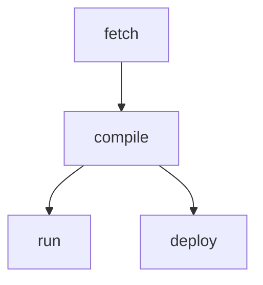
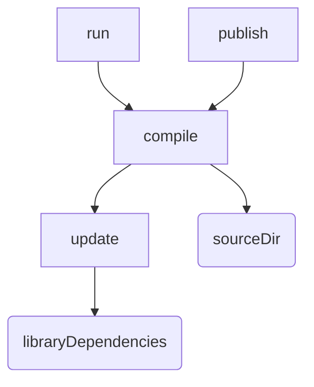
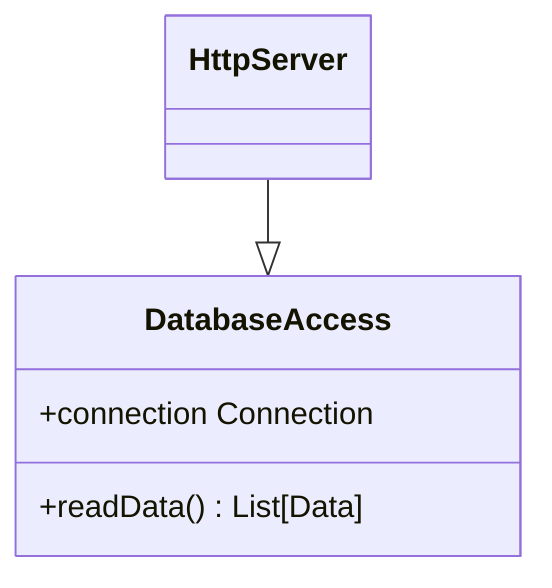
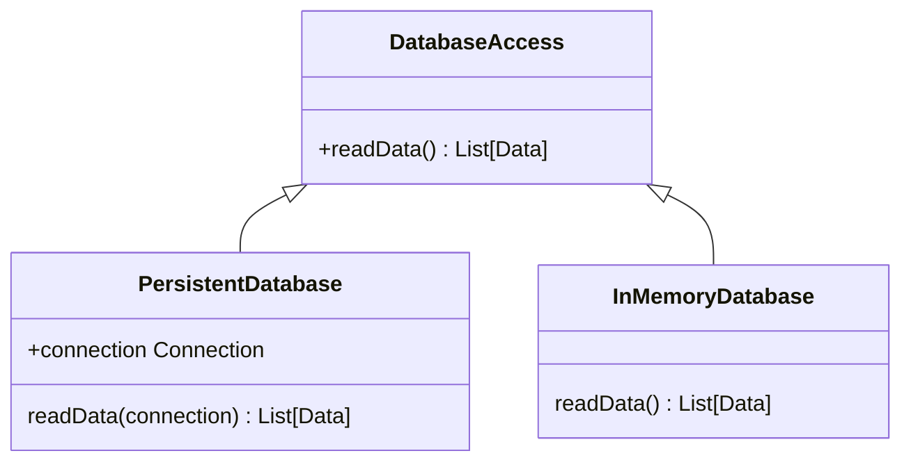
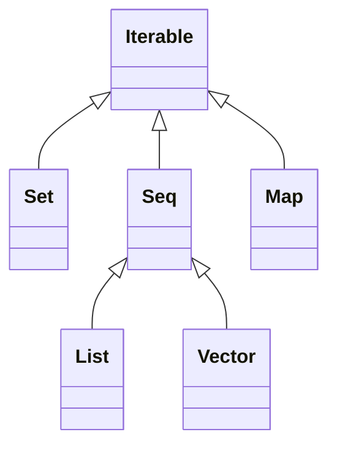
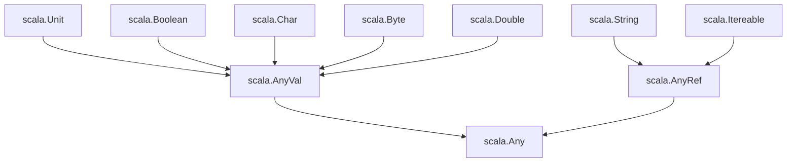

# 🚧 Session 3: Build tools, developer workflow, modules, encapsulation

## 🚧  Tooling

### 🚧  Organize Code

In summary, large Scala projects are split into multiple files. Source files contain definitions organized into **packages**. You can impor entities to not have to write their fullu qualified name every times.

### ✅ Build Tools

As a developer whe you work on a program you need:

- compile
- run
- test
- deploy

Some of these tasks can be performed by a continuos integration server, or, may be automatically triggered on source changes.

So, an important question is what is to compile a program? The answer in the context of Scala is invoking the compiler on all the source files to turn them into executable JVM bytecode. this process require:

- constructing the application classpath by fetching library dependencies,
- generating parts of the source code or resources (e.g., assets, data, type serializers, etc.)

Building an execution environment (i.e, a JVM with the correct classpath), invoking the entry points, requires compiling the program.

Also, execute tast like:

- publish an artifact on a library repository,
- package the program and its dependencies as a single `.jar` file,
- publish a Docker image
- publish documentacion
- ...

requires compiling the program.

Invoke manually these tasks (compiling, fetching dependencies, etc.) in the right order is cumbersome. Instead **build tools** can manage these task for you.

Idea: you indicate where you program source files are located, which libraries your program depends on, and the build tool takes care of feteching the dependencies, invoking the compiler, running the test, and more.

Generally, build tools are not limited to a specific developer workflow but implement a generic task engine able to coordinate the execution of a graph of tasks.



In summary, working oin program involves performin various independent ta sks such as compiling, running, and deploying the program. Build tools aim at simplifyin the coordination of these tasks.
### ✅ Introduction to `sbt`

`sbt` is a build tool commonly used in Scala.

> Note: there are other build tools that support Scala: Maven, Gradle, Mill, etc.

Make sure the sbt command-line tool is installed accordin to the instruction in the [sbt's oficial site](https://scala-sbt.org)

As sbt project is a directory with the following two files:

- `project/build.properties`: defines the version of sbt we want to use
- `built.sbt`: defines the configuration of the project

By default, `sbt` compiles source files that are in the directory `src/main/scala`.

When your project contains multiple Scala files, if you modify only one file, `sbt` will try to recompile only this file and the files that depend on it, but not more. This is called *incremental computation*.

To compile you project, first enter to the `sbt` cli of the project running the next command:

```
sbt
```

The out of this command should be:

```
sbt:hello-sbt>
```

In this case `hello-sbt` is the project's name. So to compile the project execute the next command:

```
sbt:hello-sbt> compile
```

Here a `/target` folder should be created as sibling of the `/project` directory. This folder is the output of the compilation an it is cached to agilize the re-compile process. 

The `run` task compiles and then runs the program:

```
sbt:hello-sbt> run
```

Another useful task is `console`, which compiles he program and then opens a Read-Eval Print Loop (REPL), an interactive prompt to evaluate expressions in your program.

Below its recopile in a graph the main concepts and their dependencies:



There are two main conceps int `sbt`:

- **Settings**: Parametrize the build, ther are evaluated one (e.g., sourceDir, libraryDependecies)
- **Tasks**: Perform action (download, compile, run, etc.), they are evaluated at each invocation.
  
Tasks can be parametrized by setting.

Speaking of *library dependencies*, let's see how to use a library for colorizing the text we print to the console. First, we need to declare the dependency in the build definition by appending the so-called coordinates of the library to the `libraryDependencies` key. So to find the coordinates of the library, I'm going to use the [Scala Index](https://index.scala-lang.org). The library I want to use is named [Fansi](https://index.scala-lang.org/com-lihaoyi/fansi). Now we update the `build.sbt` file with the next content

```
// build.sbt
scalaVersion := "3.0.0-RC1"
libraryDependencies += "com.lihaoyi" %% "fansi" % "0.3.0"
```

To ensure the inclusion of the librery we should re-build the project. So, lets `run` the program:

```
sbt:hello-sbt> run
```
and then let's `reload` it.

```
sbt:hello-sbt> reload
```

Now to use the library, lets update the `HelloSbt.scala` file with the next content:

```scala
package hellosbt

val greeting =  "Hello, sbt!!!"

@main def run(): Unit = println(fansi.Color.Red(greeting))
```

After this change when we `run` the program, we get the `"Hello, sbt!!!"` message in red.

This way is how we include library dependencies in Scala via `sbt`

`sbt` provides common predefined task and settings out of the box. Additional task or predefined configurations can be provided by **plugins**. Plugins define how the build itself is managed and must be declared in the `project/plugins.sbt`

In summary, `sbt` is a build tool for Scala. It is interactive: you start the sbt shell in the morning and manage your project from there. The build definition is written in Scala. A build definition essentially assigns values to setting keys (such as `scalaVersion`, or `libraryDependencies`)

### ✅ sbt, Keys and Scopes

Let's understand the Scopes concpet in `sbt` and how use them.

We have seen that the source directories are different for the program and its tests. However, there is a single key `sourceDirectory` that allow us to identify the source directory of the project. It is important to know that a key can have different values in diferent **scopes**. Lets illustrate this with the next outputs in the terminal:

```
sbt: hello-sbt> Compile / sourceDirectory
src/main

sbt: hello-sbt> Test / sourceDirectory
src/test
```

There is a single concept of source directory, modeled by the key `sourceDirectory`, reused by both `Compile` and `Test` configurations by scoping the key to the corresonding configuration.

By scoping the key to the corresponding configuration, each key can be assigned a value along a configuration such as `Compile`, `Test` or no specific configuration which is named `Zero`. 

When we look up the value of a key, we can specify the configuration we are interested. If no configuration is specified, `sbt` first tries with the `Compile` configuration and falls back to the `Test` configuration. For instance, just `run` is equivalent to `Compile / run`, which means run in the Compile configuration.

Conversely, if we look up for `Compile / scalaVersion`, which means the value of the setting `scalaVersion` in the scope of the Compile configuration. The key `scalaVersion` has no value in that scope. Then `sbt` falls back to a more generic scope. It looks up in the `Zero` configuration.

Configurations are just one possible axis of key scoping.

Keys can also have different values according to a particular **task** key. For instance, the task `unmanagedSources` lists all the projects source files:

```4yy
sbt: hello-sbt> show unmanagedSourcse
[info] * src/main/scala/hellowsbt/Main.scala
```

The task can be configured by changing the value of the setting `includeFilter`:

```
sbt: hello-sbt> show unmanagedSourcse / includeFilter
[info] ExtensionFilter(java, scala)
```

By default, `sbt` looks for source files with extension `.java` and `.scala`. Let's include `.sc` files in the unmanaged sources updating the `build.sbt` file:

```
// built.sbt
unmanagedSourcse / includeFilter := new io.ExtensionFilter(
    "java",
    "scala",
    "sc"
)
```

and then, when we launcg the query we get:

```
sbt: hello-sbt> show unmanagedSourcse / includeFilter
[info] ExtensionFilter(java, scala, sc)
```
There is a third axis that can be used to assign values to sbt keys.

When a project contains sub-projects, each sub-project can set its own values for some keys. This is typically the case for the setting `baseDirectory`, which defines the root directory of each sub-project.

In our build definition example, we only have one project, so all our settings are scoped to this project. We can explicitly see that by prefixing the name of a key with the name of our project, `hello-sbt`. 

```
sbt: hello-sbt> hello-sbt / sourceDirectory
[info] src
```

There is also a special project named `ThisBuild`, which means the "entire build". so a setting applies to the entire build rather than just a single project.

`sbt` falls back to `ThisBuild` when you look for the value of a key that has not been defined for a specific project.

This is a convenient way to define cross-project settings

```
// Set the Scala version for all the projects in this build definition
ThisBuild / scalaVersion := "3.0.0"
```

Here is how we can see the value of the `includeFilter` key according multiple axes:

```
// current project, no configuration, unmanagedSource task
unmanagedSources / includeFilter

// hello-sbt project, no configuration, unmanagedSource task
hello-sbt / unmanagedSources / includeFilter 

// hello-sbt project, Compile configuration, unmanagedSource task
hello-sbt / Compile/ unmanagedSources / includeFilter 
```

In summary, when the same concept (e.g., a source directory) is reused in several context such as configurations (e.g., the program and its test), or tasks, sbt encourages you to use a single setting key for this concept and to scope the value you assign to it to the desired context.

### ✅ Program Entry Point

Unlike worksheets that are evaluated from top to bottom, Scala projects hava a program entry point.

A program entry poin is a mehtods definitions annotated with `@main`,

Program entry points can take parameters.

Project source files cannot contain top-level statements, only top-level definitions. Those top-level definitions are `def`, `val`, `var`, `object`, `trait`, and `class` definitions.

## 🚧 Modules

Consider the following situation. We want to implement a program that exposes data read from the database as JSON documents.

The part of the program that exposes the data calls the part of the program that reads from the database, and it serializes the result into JSON.

The *problem* we want to avoid is that if the database connection is widely available to any part of the program, it might be too easy to mess up with the state of the system. Instead, we want to restrict access to the database connection, so that we can increase our confidence that the code that uses it is correct. 

This leads to the following architecture:



The HTTP server cannot access the underlying `connection` of the `DatabaseAccess` module. It can only use the public `readData()` operations.

Translate the diagram into Scala code should throw the next definitions:

```scala
class DatabaseAccess(connection: Connection):
    def readData(): List[Data] = ...

class HttpServer(databaseAccess: DatabaseAccess):
    ...
    databaseAccess.readData()
    ...

def main() =
    val connection: Connection = ...
    val databaseAccess: DatabaseAccess = DatabaseAccess(connection)
    val httpServer: HttpServer = HttpServer(databaseAccess)
    ...
```

Let's go deep in the next lines fo code:

```scala
class DatabaseAccess(connection: Connection):
    def readData(): List[Data] = ...
        connection
        ...
```

This code defines a **type** `DatabaseAccess`and a **constructor** of the same name. The type `DatabaseAccess` has one method, `readData`.

By contrast with case classes, constructor parameters of "simple" classes area **private**. i.e., they can be accessed only from the class body.

This highlights one difference between case classes and simple classes: the former achieve aggregation whereas the latter achieve **encapsulation**. Let's go deep with encapsulation in the next section.
### ✅ Encapsulation

Class members are public by default: a user of the class `DatabaseAccess` can call its `readData` operaiton. It is also posible to define private members by qualifying them as such:

```scala
class DatabaseAccess(connection: Connection):
    private def decodeTableRow(row: TableRow): Data = ...
    def readData(): List[Data] = ...
```

The operation `decodeTableRow` can only be called from the insde of the class `DatabaseAccess`.

Sometimes, is useful have several implementations of the same type. For instance is a common practice to use a persistent database for production, but an in-memory database for some tests.



You can define an interface in Scala by writing a `trait` definition.

```scala
trait DatabaseAccess:
    def readData(): List[Data]

class PersistentDatabase(connection: Connection) extends DatabaseAccess:
    def readData(): List[Data] = ...

class InMemoryDatabase extends DatabaseAccess:
    def readData(): List[Data] = ...
```


Again, let's check the next lines of code:

```scala
trait DatabaseAccess:
    def readData(): List[Data]
```

This code defines a **type** `DatabaseAccess` but **no constructor**. The type `DatabaseAccess` has one **abstract method**, `readData`.

Unlike sealed traits, "simple" traits can have an unbounded number of implementations.

Classes that extend the trait `DatabaseAccess` have to implement the method `readData`, otherwise, it will throw a compile error.

> Note: It is good practice to depend on interfaces rather than specific implementations. 

Below, it is recopile the visibility class/trait members:

- **public** members are visible from the outside of a class or trait, 
- **private** members are visible from the inside of class or trait, and there is a third level of visibility.
- **protected** members are visible from the inside of a trait or class and from the inside of its descendant (but not from the outside like private members).

Let's check the protected members with an example. With a combinatin of protected and abstract members we can make a dish while delaying to a later point the secret sauce brought by a chef:

```scala
trait Chef:
    protected def secretSauce(sauce: Sauce): Sauce
    def makeDish(meat: Meat, vegetables: Vegetables: Dish) =
        ...
        sercretSauce(...)
        ...

object YukihiraSoma extends Chef:
    protected def secretSauce(sauce: Sauce): Sauce = ...
```

In summary, define abstraction barriers with classes and traits, which encapsulate implementation details.

Use private members to restrict the visibility of members to the inside of class or trait definition, and use abstract members to delay the implementation of operation to concrete classes.

### 🚧 Extending and Refining Classes

In this section let's check the feature of Scala to do object-oriented programming.

Traits and classes can form a rich hierarchy. An example is the standard collections.



Each subtype may introduce more specific methods. For instance, the type `Seq` introduces methods for sorting elements. This operation does not exist on `Set` and `Map` because by definition their elements have no order.

Actually, each collection type comes in two variant, immutable and mutable.

Scala has the next class hierarchy:




At the top of the type hierarchy we find:
    - `Any` the base type of all types; methods `==`, `!=`, `equals`, `hashCode`, `toString`
    - `AnyRef` The base type of all reference types; alias for `java.lang.Object`
    - `AnyVal` The base type of all primitive types.

A clas or object definition can extend **several** traits:

```scala
trait Logging:
    val logger = ...

class InMemoryDatabase extends DatabaseAccess, Logging:
    def readData(): List[Data] =
    ...
    logger.debug("...")
```

Also you can **override** the implementation of inherit members. For prevent a member from being overridden you can qualifying it with `final`.

Last, within a class definition, you can use the identifier `this` to refer to the instance being defined.

We have introduced traits with abstract methods as a way to define interfaces, and classes that extend these traits as a way to provide concrete implementations. Scala supports other variations around traits and classes, such as abstract classes, traits parameters, or secondary constructors. These constructs have subtle differences or specificities, which are out of the scope of this post.

In summary, types form a hierarchy whose top type is `Any`.

Multiple traits can be mixed to a class or an object definition.

From within a class definition, you can refer to:

- The instance being defined with the identifier `this`
- the parent implementation of a methods `m` with `super.m`

You can override inherited members, unless they are final.

### 🛑 Case Classes vs Simple Classes

### 🛑 Opaque Types

### 🛑 Extensions Methods

// ✅  🚧  🛑