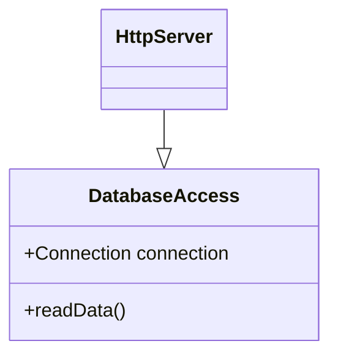
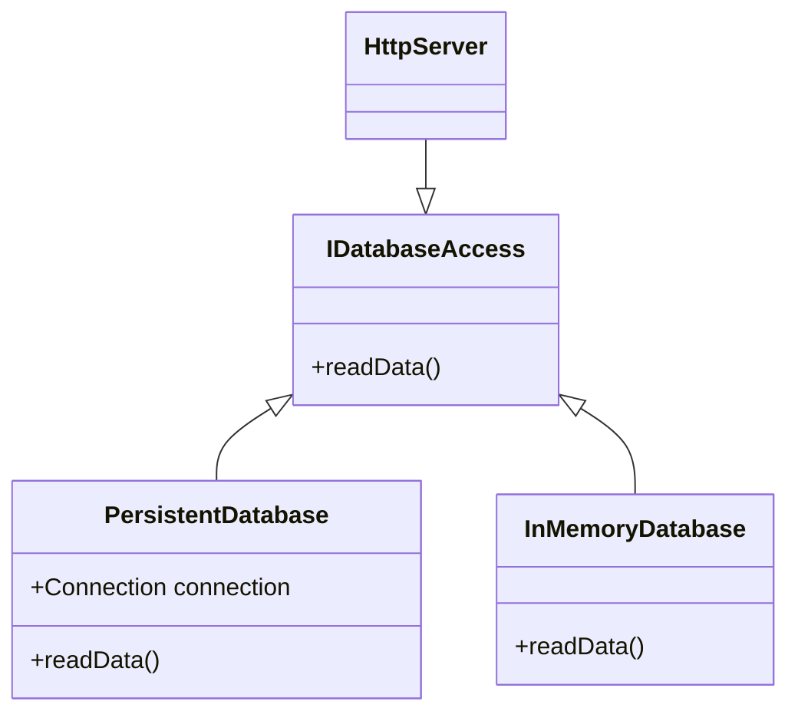

# Reasoning About Code, Testing
The recommendation in Scala is to use immutable data types by default. Indeed, they have desirable properties such as being thread-safe and allowing local reasoning. However, in some cases, mutable variables lead to simpler code, as you will see in the lectures. We then dive into different testing techniques such as unit testing, property-based testing, integration testing, and mocking.

#### Learning Objectives
- Understand the tradeoffs of using mutable values vs immutable values
- Write unit tests
- Write property-based tests
- Write mocks
- Write integration tests

## Reasoning About Code

### Reasoning About Code

Let's see an example of a program that is badly designed and requires you to know about its implementation details to avoid making mistakes when you called the program. Let's draw a smiley.

We can break down the problem into simpler parts:
- draw the eyes;
- draw the mouth;

Here is how we can draw an eye on an HTML Canvas:

```scala
def drawEye(x: Double, y: Double): Unit =
    graphics.beginPath()
    graphics.arc(x, y, 15, 0, math.Pi * 2)
    graphics.stroke()
    graphics.fillStyle = "blue"
    graphics.fill()
```

And here is how we can draw a mouth:

```scala
def drawMouth(x: Double, y: Double): Unit =
    graphics.beginPath()
    graphics.arc(x, y, 200, math.Pi / 4,3 *  math.Pi / 4)
    graphics.lineCap = "round"
    graphics.lineWidth
    graphics.strokeStyle = "red"
    graphics.stroke()
```

Then we can combine them to create a draw smiley:

```
drawEye(170, 150)
drawEye(330, 150)
drawMouth(250, 200)
```

But now consider the following two variations of the final program.

```
drawEye(170, 150)       drawMouth(250, 200) 
drawEye(330, 150)       drawEye(170, 150)
drawMouth(250, 200)     drawEye(330, 150)
```

Can we switch the order of those lines without changing the meaning of the program? **We cannot**.

So what's happening there? Why does swapping those lines change the meaning of the program? Are these lines not independent of each other? Actually no, the two methods `drawMouth` and `drawEye`, share the same global graphic context. 

The fact that both methods `drawMouth` and `drawEye` depends on the same mutable object `graphics`, prevents us from reasoning locally about these methods.

Indeed, we can't just expect `drawEye` to do what we read in its implementation, we also have to make sure that the `graphics` context is in the right state before we call `drawEye`.

The strategy I've been using to manage complexity was to break down complex programs into smaller programs and to combine them. 

This strategy aims at reducing the cognitive load to reason about programs because you only need to reason on a subset of the whole system. 

However, if local reasoning is not possible, for instance (ie, if combining programs requires knowledge about their implementation internals), then this strategy breaks down. So how can we prevent these problems from happening?

### Refactoring-Proof Programs

Let's elaborate on the root cause that made it harder to reason about code in the previous section. You wiil see how to design programs support local reasoning.

In the previous example, we saw that it is sometimes difficult to reason about the meaning of programs. Now, we will go one step further and identify two types of programs and the assumptions we can make (or not) to reason about them.


Consider the following program that computes the area of a square window of a size randomly chosen between the values 1, 2 and 3 meters:

 ```scala
 def windowSide = util.Random.between(1, 4) // util.Random provided by scala
 def windowArea = windowSide * windowSide

 println(windowArea)
 ```

What does the expression `windowArea` evaluate to? The problem is that the expression `windowSide` by `windowSide` evaluates `windowSide` two times, and each evaluation possibly returns a different random value. 

So we can "fix" the problem by using `val` definition instead of a `def` definition, so that the result of the first evaluation of. But, why does changing `def` into `val` have such an important impact on the behavior of the program?

Actually, the fact that evaluating the expression `Random.between(1, 5)` several times returns possibly different results has important consequences on our ability to reason about it. In particular, we must be very careful when we refactor the code that chooses Random.between.

Check the following algebraic identity:

```
x + x = 2 * x
```

It suggest that we could refactor any expresion of the form "x + x" into " 2 * x" without changin its meaning. For instance:

```
42 + 42 == 2 * 42
```

However;

```
Random.between(1, 4) + Random.between(1, 4) == 2 * Random.between(1, 4)
```

It is not true. Here we enter into the dilema of doing vs describing. In addition to returning a value these operations also "do something" out of the control of the program (in this case, changing the internal state of the `Random` objects.

We say that these operations have **side-effects**. We can classigy them in two categories:

- operations that modify the state of the program
- operations that communicate with the "outside world" (printing to a file, rending from a socket, etc.)

By contrast, operations that only describe what results to return given a set of input parameters are always refactoring-proof. They are also called "purely functional" or "referentially transparent" in the literature.

The example with `windowSide` and `windowArea` was a bit simplistic. But in large code bases, operations with side-effects can be hard to manage because small changes can have large and unexpected consequences.

 By contrast, referentially transparent operations are not subject to these problems because they do nothing more than returning a result that only depends on their input parameters

 To summarize, we have seen that operations that have side-effects open the door to a class of issues that do not exist with referentially transparent operations. As a consequence, side-effecting operations should be used with extra care.

### A Case for Side-Effects

In this section let's discuss the trade-off of alternatives to side-effects. 

Previously, we have seen that side-effecting operations have drawbacks that requires developers to manipulate them with extra care, but *why do we have side-effects at all?*

Let's try to implement a random number generator without using side-effects.

```scala
class Generator(previous: Int):
    def nextInt(): (Int, Generator) =
        val result = previous * 22_695_477 + 1
        (result, Generator(result))
    end Generator

object Generator:
    def init: Generator = Generator(42) // We use a linear congruential generator.
```

The operation `nextInt` returns a random `Int` value and the next `Generator` to use:

```scala
val gen1 = Generator.init
val (x, gen2) = gen1.nextInt()
println(x) // 953210035
val (y, _) = gen1.nextInt()
println(y) // 953210035
val (z, gen3) = gen2.nextInt()
println(yz // -570911984
```

The `between` operation can be implemented in the class `Generator`:

```scala
def between(x: Int, y: Int): (Int, Generator) =
    val min = math.min(x, y)
    val delta = math.abs(x - y)
    val (randomValue, nextGenerator) = nextInt()
    ((randomValue % delta) + min, nextGenerator)
```

Then, the random number generator can bbe used like this:

```scala
val gen1 = Generator.init
val (windowSide, _) = gen1.between(1,4) // windowSide = 2
val windowArea = windowSide * windowSide // : Int = 4
```

However, one drawback of this approach is that we must be careful to use each generator **only once**. The problem becomes worse if several parts of our program use random number generators.

```scala
val gen1 = Generator.init
getSomething(gen1, getSomeOtherThing(gen1))
```

Here, by passing `gen1` at two places we will get same random numbers in both places.

The correct way to use our random number generator is the following:

```scala
val gen1 = Generator.init
val (otherThin, gen2) = getSomeOtherThing(gen1)

getSomething(gen2, otherThing)
```

The method `getSomeOtherThing` needs to also return the next generator to use. When we call `getSomething`, we must be careful to use `gen2` and not `gen1`, of course.

Arguably, this is more tedious to write than using the side-effecting number generator:

```scala
getSomething(getSomeOtherThing())
```

To summarize, "pure" alternatives to side-effect introduce accidental complexity by requiring developers to explicitly carry over the "context" they operate on.

Some techniques exist to simplify this task, but they always come with some constraints.

There is no silver bullet, just choose the approach that works best for you by taking into account their pros and cons.

### Mutable Objects

The key difference between case classes and regular classes is that regular classes have a notion of identity that changes the way instances are compared together. 

Previously we have seen how to implement a "pure" random number generator. Let's see how to implement a random number generator that uses side-effects.

```scala
object Generator:
  var previous: Int = 42

  def nextInt(): Int =
    val result = previous * 22_695_477 + 1
    previous = result
    result
end Generator
```

The key changes in this version is the use of `var` in the `previous` variable an the update of `previous` to `result` each time we generate a new value. With these specs the object `Generator` is a **mutable object**, it has a state tht may change over the time.

Here is an example of mutable class that models a bank account:

```scala
class BankAccount:
  private var balance: Int = 0
  def deposit(amount: Int): Int = 
    if amount > 0 then balance = balance + amount
    balance
  
  def withdraw(amount: Int): Int = 
    if amount > 0 && amount <= balance then
      balance = balance - amount
    balance
end BankAccount
```

Below is the use of the bank account

```scala
val account = BankAccount()

account.deposit(30) // 30
account.deposit(30) // 60
account.withdraw(50)// 10
```

Mutable clases raise a new problem: what does it mean for two instances to be equal?

In an immutable world, if we write:

```scala
val x = Rectangle(5, 8)
val y = Rectangle(5, 8)
```

Then, we expect `x == y` to be true.

More generally, in an immutable world if we write:

```scala
val x = E
val y = E
```

where `E` is an arbitraty expression, then we expect that `x` and `y` are the same. That is to say that we could refactor the program to:

```scala
val x = E
val y = x
```

without changing the meaning of the program.

But once we use mutable objects, the situation is different. For example:

```scala
val x = BankAccount()
val y = BankAccount()
```

Are `x` and `y` the same bank account? The answer is no. Even if two bank accounts may have the same balance at one point in time, they are still two different bank accounts

By default, Scala already does "the right thing": comparing two instances of `BankAccount` with the same blance will return `false`, but comparing two instances `Rectangle` with the same lenght and width will return true.

This highlights one key difference between plain classes and case classes: plain classes equality is checked by comparing the "identity" of their instances, whereas cases classes equality is checked by comparing the values carried by their instances.

As consequence objects are not "refactoring-proof": we cannot replace:

```scala
val x = E
val y = E
```

with

```scala
val x = E
val y = x
```

without changing the meaning of our program.

Therefore, it is a good practice to prefer immutable data types (for instances, immutable collections).

To summarize, we have seen that mutable objects are objects whose internal state can vary over time.

Consequently, distinct instances of mutable classes are not the *same*, even though they may carry the same values at one point in time. We say that they have distinct **identities**.

It is a good practice to prefer working with immutable data types.

## Testing

It is time to check how to increase your confidence in the code that you write, and validate that it does what you expect by writing unit tests.

### Unit Testing

How do we make sure that the program we wrote does what we intended?

*Reading* the source code of the program can consolidate our understanding of what it does. However, it may work fine for small and concrete things but it requires a lot of effort to reason about the whole program or very abstract code.

The *type system* can help us by ensuring that program parts are correctly combined together. However, it relies on the assumption that we correctly model things in the first place. Also, only a small class of errors can be caught by the type system.

Software is soft. Code bases evolve over time and by changing small things here and there, we sometimes change the behavior of the program under certain conditions in a breaking way. So, we need robust ways to prevent these regressions to happen. In this video and the following ones

We have different testing techniques that we can use to  increase our confidence that the code we have written matches our initial intent.

Unfortunately, it is very hard to reach a 100% confidence level. All the techniques have different trade offs in terms of costs, coverage, and robustness.

The simplest way to test the program is to write another program that calls the program under test with parameters for which we know what the expected results should be. This technique is called **unit testing**.

Let's test the following program:

```scala
// File src/bain/scala/testing/Program.scala

/** @return the sum of 'x' and 'y' */
def add(x: Int, y: Int): Int = ...

/** @return the 'n'th Fibonacci number (the first number is 0) */
def fibonacci(n: Int): Int = ...
```

In sbt projects tests go to the `src/test/scala/directory` (as opposed to `src/main/scala` for the sources of the program).

It is common practice to use tests with names that mirror the names of the tested programs.

For our example, we want to test a program return in the file program.scala. So we write a test suite in the file `src/test/scala/testing/ProgramSuite.scala`.

There are several testing libraries in Scala. Here, we show you how to get started with MUnit, a simple testing library.

Add the following settings to your `build.sbt` file.

```scala
libraryDependencies += "org.scalameta" %% "munit"% "0.7.19" % Test
testFrameworks += new TestFramework("munit.Framework")
```

Now let's define a test suite. A test suite is a class that extends `munit.FunSuite`

```scala
class ProgramSuite extends munit.FunSuite:

  test("add") {
    // TODO Write test specification for the 'add' method
  }
  
  test("fibonacci") {
    // TODO Write test specification for the 'fibonacci' method
  }
  
end ProgramSuite
```

Next step is write the test specification. Here we use the `test` and `assertEquals` methods, inherit from `munint.FunSuite`.

```scala
class ProgramSuite extends munit.FunSuite:

  test("add") {
    val obtained = add(1, 1)
    val expected = 2
    assertEquals(obtained, expected)
  }
  
end ProgramSuite
```

We give a name to the test specification (here, "add"), and we write the implementation in a second argument.

Finally we should run the test suite and wait for the report. We can run the test from the code editor or via sbt shell with the next command:

```
sbt test
```

To summarize, writing tests can increase your level of confidence in the fact that your program behaves as expected. Furthermore, tests are a good way to prevent regressions.

Unit tests let you check the result of a program for some specific inputs. However, you have to think about all the corner cases to check

### Property-Bases Testing

Let's review an alternative way of writing tests that helps to increase the coverage of the tested domain, and to discover edge cases.

In the fibonnaci example, we define 5 cases for the unit test created. Is it enough to check 5 cases to conclude that the implementation is correct?

Writing each test example takes a bit of time. Generally, program domains are huge and it would be impossible to write test cases manually for the whole domain space. You can make the effort of writing test for all use edge cases, but you would still miss a lot of cases.

Another approach is to generate random input data.

How we can specify the expected result of calling a program with data that we do not know?

You can only specify general **properties** that must be correct for all possible inputs or a well delimited subset.

In the case of the Fibonacci method, an example of property that we want to check is this Identity. The fact that any Fibonacci number is the sum of the two previous Fibonacci numbers, which is the definition of Fibonacci suite.

ScalaCheck is a library for doing property-based testing. It integrates with MUnit so that you only need to add the following dependency to the `built.sbt`:


```scala
libraryDependencies += "org.scalameta" %% "munit-scalacheck" % "0.7.19" % Test
testFrameworks += new TestFramework("munit.Framework")
```

A test suite containing properties is a class that extens `munit.ScalaCheckSuite`:

```scala
package testing

class ProgramProperties extends munit.ScalaCheckSuite:

  property("fibonacci(n) == fibonaci(n - 1) + fibonacci(n - 2)") {
    ...
  }
  
end ProgramProperties
```

You define properties by calling the method `property` in the body of the class. This method receive as first parameter the name of the property test, and the second parametera is the block that contains the definition of the property tick. Lets write the second parameter for our property test.

```scala
import org.scalacheck.Prop.forAll

class ProgramProperties extends munit.ScalaCheckSuite:

  property("fibonacci(n) == fibonaci(n - 1) + fibonacci(n - 2)") {
    forAll() { (n: Int) =>
      fibonacci(n) == fibonacci(n - 1) + fibonacci(n - 2)
    }
  }
  
end ProgramProperties
```

The method `forAll` takes as a parameter a function that receives an arbitrary value (here `n` of type `Int`), and returns a `Boolean` as result. In this example, we check that Fibonacci of `n` is equal to Fibonacci of `n -1` plus Fibonacci of `n - 2`.

You can run property-based tests like usual test suites by clicking on the test button just above the class definition. 

If we run this property test we got an error in the report when we evaluate the case for `1`. The problem here is that there is no zero element or minus one element in the Fibonacci sequence. The first element of the Fibonacci sequence has index one. Indices below one are just invalid. We should exlude such input values from the test, or, we could narrow the input type of the `fibonacci` method: It currently takes an `Int`, we could replate it with a type `PosInt` whose values would be guarenteed to be always greater than zero.


```scala
import org.scalacheck.Prop.forAll

class ProgramProperties extends munit.ScalaCheckSuite:

  val fibonacciDomain = Gen.choose(1, 47)
  
  property("fibonacci(n) == fibonaci(n - 1) + fibonacci(n - 2)") {
    forAll(fibonacciDomain.suchThat(_ >= 3)) { (n: Int) =>
      fibonacci(n) == fibonacci(n - 1) + fibonacci(n - 2)
    }
  }
  
end ProgramProperties
```

The differnece with the previous version is that we add the variable `fibonacciDomain` indicating the range of numbers that we want test with the property.

Good properties may be hard to find or formulate. You should look for **invariants** like also Fibonacci numbers up positive and **identities** like Fibonacci of n to be equal to Fibonacci of n minus one plus Fibonacci of n minus two. You can learn more about this in the talk, "Much Ado About Testing" by Nikola Rinaudo, which you can find online.

To summarize, property-based testing makes it easier to increase the coverage of the tested domain and helps to find edge cases. In our case, we were able to find the limit of our implementation of Fibonacci. However, good properties can be hard to find. Be careful to not re-implement the system under test.

### Mocking

Let's check a simple approach to mock components when you write a test.

In a system made of components that depend on other components, how do we test just one component without having to also set up all the components that it depends on?


in this example, we have an HTTP server that depends on database access component, which is responsible for communicating with the database.

So, the anwser of the previous question is mock the component that are depended on. For our example we would mock the `DatabaseAccess` component

Mocking consists in providing a fake implementation of a component that can be substituted to the component for the purpose of a test. 

We have already seen how to design components are easier to mock, lets recall the example:



Here, we would define a trait database access with two implementations. The persistent database, which we would use in the real application, and the in-memory database that we would use in the tests.

In the test In the tests, we would wire the database access component to an instance of an in-memory database. 

```scala
class HttpServerSuite extends munit.FunSuite:
  val databaseAccess = InMemoryDatabase()
  val httpServer = HttpServer(databaseAccess)

  test("something") {
    ...
  }

class InMemoryDatabase extends DatabaseAccess:
  ...
```

Unfortunately, in some cases this solution is not applicable. For instance, if the operations of the interface to implement are too numerous or too complicated.

In this situation, you can use a mocking library such as ScalaMock. Such libraries make use of advanced techniques available on the JVM to create fake component implementations. Mastering these techniques is out of the scope of this posts.

To summarize, mocking components makes it easier to set up tests. The test may run faster and the test outcome cannot be influenced by a bug in a dependency of the tested component. However, beware that this technique does not test the whole system as it will be deployed to production.

### Integration Testing
Time to review how to set up and shut down resources during the lifetime of a test execution.

Testing the parts of a system in isolation is good, but new problems can arise when we assemble the parts together. Integration testing is the practice of testing a complete system with no stubs or mocks. 

 What makes integration testing complex is that you need to be able to programmatically set up the entire stack, or significant part of it, to a specific state. According to your test scenario, this sometimes includes setting up external services that your program depends on, such as a database. 

MUnit lets you set up and shut down a resource for the lifetime of a single test. Lets review this with  an example to set up an HTTP server:

```scala
class HttpServerSuite extends munit.FunSuite:
  val withHttpServer = FunFixture[HttpServer](
    setup = test => {
      val httpServer = HttpServer()
      httpServer.start(8888)
      httpServer
    },
    teardown = httpServer => httpServer.stop()
  )

  withHttpServer.test("server is running") { httpServer =>
    // Perform HTTP request here
  }
```
Sometimes it's considerably more performant to set up the stack once at the beginning, then *ran all the tests* and eventually shut down the system. We achieved that by overriding the methods `beforeAll` and `afterAll` of the `FunSuite` class.

```scala
class HttpServerSuite extends munitFunSuite:
  val httpServer = HttpServer()
  override def beforeAll(): Unit = httpServer.start(8888)
  override def afterAll(): Unit = httpServer.stop(8888)

  test("server is running") {

  }

  test("another test on HTTP server") {

  }
```

To summarize Integration Tests are interesting because they make the system closer to what is deployed to production. On the other hand, such test can be heavier to write, or they can take a long time to complete. Here, you have seen how to write test that required to set up and then shut down some resources.

### Testing the Tests

### Debugging

## Assestment

Quickcheck, please check the contents is in `exercises/quickcheck`.